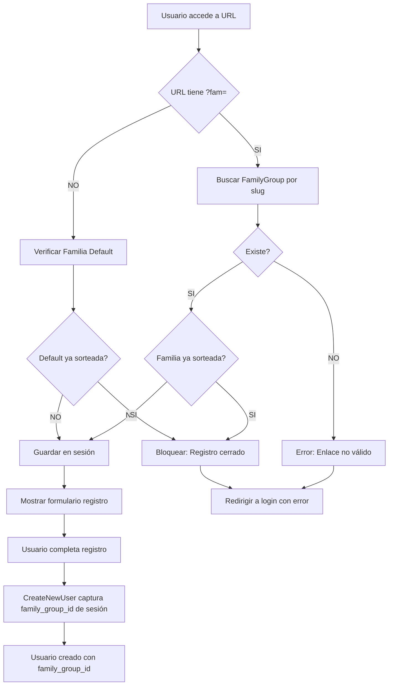
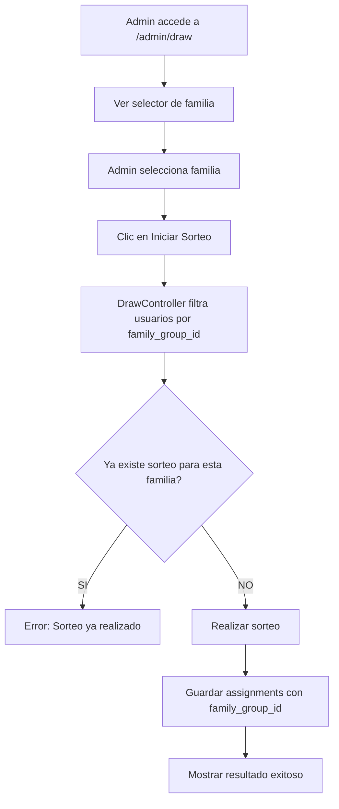

# Arquitectura Multi-Familia para Secret Santa

## Resumen Ejecutivo

Este documento describe la arquitectura para adaptar el sistema Secret Santa existente para soportar múltiples familias independientes usando un solo proyecto Laravel, diferenciadas por parámetros URL.

## Objetivos

1. ✅ Permitir múltiples familias independientes en una sola instalación
2. ✅ Diferenciar familias por parámetro URL en **REGISTRO**: `dominio.com/registro?fam=garcia`
3. ✅ **Login y dashboard NO requieren parámetro** (family_group_id ya está en BD)
4. ✅ NO modificar sorteos existentes ni relaciones `family_id` actuales
5. ✅ Admin puede gestionar familias y realizar sorteos por familia específica
6. ✅ Familia original no requiere parámetro `?fam=` en URL de registro

## Estructura de Base de Datos

### Nueva Tabla: family_groups

```sql
CREATE TABLE family_groups (
    id BIGINT UNSIGNED PRIMARY KEY AUTO_INCREMENT,
    slug VARCHAR(255) UNIQUE NOT NULL,
    name VARCHAR(255) NOT NULL,
    description TEXT NULLABLE,
    is_active BOOLEAN DEFAULT TRUE,
    enable_draw_at DATETIME NULLABLE,
    reveal_date DATETIME NULLABLE,
    profile_edit_end_date DATETIME NULLABLE,
    created_at TIMESTAMP NULL,
    updated_at TIMESTAMP NULL
);
```

**Campos:**
- `slug`: Identificador único usado en URL (ej: "garcia", "rodriguez")
- `name`: Nombre descriptivo de la familia (ej: "Familia García")
- `description`: Descripción opcional
- `is_active`: Permite desactivar familias sin eliminarlas
- `enable_draw_at`: Fecha/hora para habilitar el botón de sorteo
- `reveal_date`: Fecha/hora para revelar el amigo secreto
- `profile_edit_end_date`: Fecha límite para editar perfil

### Modificaciones a Tablas Existentes

#### Tabla: users

```sql
ALTER TABLE users ADD COLUMN family_group_id BIGINT UNSIGNED NULLABLE;
ALTER TABLE users ADD FOREIGN KEY (family_group_id) 
    REFERENCES family_groups(id) ON DELETE SET NULL;
```

**IMPORTANTE:** 
- `family_id` existente NO se modifica (maneja grupos familiares internos)
- `family_group_id` es el nuevo campo para separar familias grandes

#### Tabla: secret_santa_assignments

```sql
ALTER TABLE secret_santa_assignments ADD COLUMN family_group_id BIGINT UNSIGNED NULLABLE;
ALTER TABLE secret_santa_assignments ADD FOREIGN KEY (family_group_id) 
    REFERENCES family_groups(id) ON DELETE CASCADE;
```

### Migración de Datos Existentes

Se creará una familia "default" para usuarios existentes con las fechas actuales del .env:

```php
// Crear familia default con fechas del .env
FamilyGroup::create([
    'slug' => 'default',
    'name' => 'Familia Original',
    'is_active' => true,
    'enable_draw_at' => env('SECRET_SANTA_ENABLE_DRAW'),
    'reveal_date' => env('SECRET_SANTA_REVEAL_DATE'),
    'profile_edit_end_date' => env('SECRET_SANTA_PROFILE_EDIT_END_DATE'),
]);

// Asignar todos los usuarios existentes a familia default
User::whereNull('family_group_id')->update([
    'family_group_id' => 1
]);

// Asignar todas las asignaciones existentes a familia default
SecretSantaAssignment::whereNull('family_group_id')->update([
    'family_group_id' => 1
]);
```

**IMPORTANTE:**
- Las fechas de la familia "default" se leerán de BD, no del .env
- Esto congela las fechas originales y las protege de cambios
- Admin NO podrá editar las fechas de la familia "default"

## Arquitectura del Sistema

### Diagrama de Flujo de Registro



### Diagrama de Flujo de Sorteo



## Componentes del Sistema

### 1. Modelos

#### FamilyGroup.php (NUEVO)
```php
class FamilyGroup extends Model
{
    protected $fillable = [
        'slug',
        'name',
        'description',
        'is_active',
        'enable_draw_at',
        'reveal_date',
        'profile_edit_end_date',
    ];
    
    protected $casts = [
        'enable_draw_at' => 'datetime',
        'reveal_date' => 'datetime',
        'profile_edit_end_date' => 'datetime',
    ];
    
    public function users() {
        return $this->hasMany(User::class);
    }
    
    public function assignments() {
        return $this->hasMany(SecretSantaAssignment::class);
    }
    
    public function getRegistrationUrlAttribute() {
        return route('register') . '?fam=' . $this->slug;
    }
    
    public function hasDrawn() {
        return $this->assignments()->exists();
    }
    
    public function canDraw() {
        return now()->gte($this->enable_draw_at);
    }
    
    public function isRevealed() {
        return now()->gte($this->reveal_date);
    }
    
    public function canEditProfile() {
        return now()->lte($this->profile_edit_end_date);
    }
    
    public function isDefault() {
        return $this->id === 1 || $this->slug === 'default';
    }
}
```

#### User.php (ACTUALIZADO)
```php
// Agregar relación sin modificar métodos existentes
public function familyGroup() {
    return $this->belongsTo(FamilyGroup::class);
}

// Métodos getAllFamilyMembers() e isFamilyWith() NO SE MODIFICAN
// family_id sigue manejando grupos familiares internos
```

#### SecretSantaAssignment.php (ACTUALIZADO)
```php
// Agregar relación
public function familyGroup() {
    return $this->belongsTo(FamilyGroup::class);
}
```

### 2. Middleware

#### CaptureFamilyGroup.php (NUEVO)
```php
// Captura parámetro ?fam= y almacena en sesión
public function handle($request, Closure $next)
{
    if ($request->has('fam')) {
        $familyGroup = FamilyGroup::where('slug', $request->fam)
                                   ->where('is_active', true)
                                   ->first();
        
        if ($familyGroup) {
            // Verificar si la familia ya tiene sorteo realizado
            if ($familyGroup->hasDrawn()) {
                return redirect()->route('login')
                    ->with('error', 'El registro para esta familia ha sido cerrado. El sorteo ya fue realizado.');
            }
            
            session(['registration_family_group_id' => $familyGroup->id]);
        } else {
            return redirect()->route('login')
                ->with('error', 'El enlace de registro no es válido.');
        }
    } else {
        // Sin parámetro ?fam= => familia default
        // Verificar si familia default tiene sorteo
        $defaultFamily = FamilyGroup::find(1); // o where('slug', 'default')
        if ($defaultFamily && $defaultFamily->hasDrawn()) {
            return redirect()->route('login')
                ->with('error', 'El registro ha sido cerrado. El sorteo ya fue realizado.');
        }
    }
    
    return $next($request);
}
```

### 3. Controladores

#### Admin/FamilyGroupController.php (NUEVO)

**Métodos:**
- `index()`: Lista todas las familias
- `create()`: Formulario para crear familia
- `store()`: Guardar nueva familia (valida slug único)
- `show($id)`: Ver detalles y enlace de registro
- `edit($id)`: Formulario edición
- `update($id)`: Actualizar familia
- `destroy($id)`: Desactivar familia (no eliminar si tiene usuarios)

#### Admin/DrawController.php (MODIFICADO)

**Cambios:**
- `index()`: Agregar selector de familias + filtrar assignments por familia + leer fechas de family_group seleccionado
- `start()`: Recibir `family_group_id` y filtrar usuarios antes del sorteo + validar fecha enable_draw_at
- `performDraw()`: Mantener lógica actual pero con usuarios filtrados

**Código de Ejemplo:**
```php
public function index(Request $request)
{
    $familyGroups = FamilyGroup::withCount('users')->get();
    $selectedFamilyGroupId = $request->get('family_group_id', 1);
    $selectedFamilyGroup = FamilyGroup::find($selectedFamilyGroupId);
    
    $assignments = SecretSantaAssignment::with(['giver', 'receiver'])
        ->where('family_group_id', $selectedFamilyGroupId)
        ->get();
    
    $hasAssignments = $assignments->isNotEmpty();
    $users = User::where('family_group_id', $selectedFamilyGroupId)->get();
    
    // Usar fechas de family_group en lugar de .env
    $enableDrawTime = $selectedFamilyGroup->enable_draw_at;
    
    return view('admin.draw', compact(
        'assignments',
        'hasAssignments',
        'users',
        'enableDrawTime',
        'familyGroups',
        'selectedFamilyGroup'
    ));
}

public function start(Request $request)
{
    $familyGroupId = $request->input('family_group_id');
    $familyGroup = FamilyGroup::findOrFail($familyGroupId);
    
    // Validar que familia no tenga sorteo
    if ($familyGroup->hasDrawn()) {
        return response()->json([
            'error' => 'Esta familia ya tiene un sorteo realizado.'
        ], 400);
    }
    
    // Validar fecha
    if (!$familyGroup->canDraw()) {
        return response()->json([
            'error' => 'Aún no es tiempo de realizar el sorteo.'
        ], 400);
    }
    
    // Filtrar usuarios solo de esta familia
    $users = User::where('family_group_id', $familyGroupId)->get();
    
    // ... resto de lógica de sorteo
    
    // Guardar con family_group_id
    foreach ($assignments as $giverId => $receiverId) {
        SecretSantaAssignment::create([
            'giver_id' => $giverId,
            'receiver_id' => $receiverId,
            'family_group_id' => $familyGroupId,
        ]);
    }
}
```

#### Admin/UserController.php (MODIFICADO)

**Cambios:**
- `index()`: Agregar filtro opcional por familia
- Mostrar badge con nombre de familia en cada usuario

#### UserController.php (MODIFICADO para usar fechas de BD)

**Cambio Crítico:**
```php
public function profile()
{
    $user = Auth::user();
    $familyGroup = $user->familyGroup;
    
    // CAMBIO: Ya no leer de config/services
    // ANTES: $revealDate = new \DateTime(config('services.secret_santa.reveal_date'));
    // DESPUÉS: Usar fechas de family_group
    
    $revealDate = $familyGroup->reveal_date;
    $profileEditEndDate = $familyGroup->profile_edit_end_date;
    $now = new \DateTime();
    
    $isRevealed = $now >= $revealDate;
    $canEditProfile = $now <= $profileEditEndDate;
    
    $secretSanta = null;
    if ($isRevealed) {
        $assignment = SecretSantaAssignment::where('giver_id', $user->id)
            ->where('family_group_id', $user->family_group_id)
            ->with('receiver')
            ->first();
        if ($assignment) {
            $secretSanta = $assignment->receiver;
        }
    }
    
    return view('user.profile', compact(
        'user',
        'secretSanta',
        'isRevealed',
        'canEditProfile',
        'revealDate',
        'profileEditEndDate'
    ));
}
```

### 4. Vistas

#### resources/views/admin/family-groups/
- `index.blade.php`: Lista de familias con estado, fechas y acciones
- `create.blade.php`: Formulario creación con campos de fechas (datepickers)
- `show.blade.php`: Detalles, fechas, enlace de registro copiable
- `edit.blade.php`: Formulario edición (mostrar mensaje si es "default")

**Ejemplo de create.blade.php:**
```html
<form method="POST" action="{{ route('admin.family-groups.store') }}">
    @csrf
    
    <div>
        <label>Identificador (slug)</label>
        <input type="text" name="slug" pattern="[a-z0-9-]+" required>
        <small>Solo letras minúsculas, números y guiones. Ej: garcia, familia-rodriguez</small>
    </div>
    
    <div>
        <label>Nombre</label>
        <input type="text" name="name" required>
    </div>
    
    <div>
        <label>Habilitar sorteo desde</label>
        <input type="datetime-local" name="enable_draw_at" required>
    </div>
    
    <div>
        <label>Fecha de revelación</label>
        <input type="datetime-local" name="reveal_date" required>
    </div>
    
    <div>
        <label>Fecha límite para editar perfil</label>
        <input type="datetime-local" name="profile_edit_end_date" required>
    </div>
    
    <button type="submit">Crear Familia</button>
</form>
```

#### resources/views/admin/draw.blade.php (MODIFICADO)
```html
<!-- Agregar selector ANTES del botón de sorteo -->
<div class="mb-6">
    <label>Seleccionar Familia para Sorteo:</label>
    <select id="familyGroupSelect">
        @foreach($familyGroups as $group)
            <option value="{{ $group->id }}">
                {{ $group->name }} ({{ $group->users_count }} usuarios)
                @if($group->hasDrawn()) - ✓ Sorteo realizado @endif
            </option>
        @endforeach
    </select>
</div>
```

## Flujo de Usuario Admin

### Gestión de Familias

1. **Crear Nueva Familia:**
   - Admin va a `/admin/family-groups/create`
   - Ingresa: slug (ej: "garcia"), nombre (ej: "Familia García")
   - Sistema valida slug único y genera enlace
   - Admin copia y comparte: `dominio.com/registro?fam=garcia`

2. **Listar Familias:**
   - Ver todas las familias registradas
   - Indicador de cuántos usuarios tiene cada una
   - Indicador de si ya se realizó sorteo
   - Acceso a enlace de registro

3. **Realizar Sorteo por Familia:**
   - Admin va a `/admin/draw`
   - Selecciona familia del dropdown
   - Sistema muestra solo usuarios de esa familia
   - Inicia sorteo (solo si no existe sorteo previo para esa familia)
   - Asignaciones se guardan con `family_group_id`

## Validaciones y Reglas de Negocio

### 1. Registro de Usuario
- ✅ Si URL tiene `?fam=`: Buscar familia, validar que exista y esté activa
- ✅ **BLOQUEAR registro si familia ya tiene sorteo realizado**
- ✅ Si URL NO tiene `?fam=`: Usar familia default (NULL o ID 1)
- ✅ **BLOQUEAR registro en familia default si ya tiene sorteo**
- ✅ Mostrar mensaje claro: "El registro ha sido cerrado"
- ✅ Redirigir a login con mensaje de error
- ✅ Asignar `family_group_id` al crear usuario (solo si no hay sorteo)

### 2. Sorteo
- ✅ Admin DEBE seleccionar familia antes de iniciar
- ✅ Validar que familia no tenga sorteo previo
- ✅ Filtrar SOLO usuarios de la familia seleccionada
- ✅ Guardar `family_group_id` en cada assignment
- ✅ Mantener lógica de validación de family_id interno

### 3. Visualización
- ✅ Usuarios ven SOLO su asignación (sin cambios)
- ✅ Admin puede filtrar usuarios por familia
- ✅ Admin ve sorteos separados por familia

## Uso del Parámetro ?fam=

### ⚠️ **IMPORTANTE: El parámetro ?fam= SOLO se usa en REGISTRO**

El parámetro `?fam=` solo es necesario durante el **proceso de registro inicial**. Una vez que el usuario está registrado, su `family_group_id` queda guardado permanentemente en la base de datos.

**URLs por Función:**

| Acción | URL | Requiere ?fam= | Razón |
|--------|-----|----------------|-------|
| **Registro** | `dominio.com/registro?fam=garcia` | ✅ SI | Para asignar familia al crear usuario |
| **Login** | `dominio.com` | ❌ NO | Usuario ya tiene family_group_id en BD |
| **Dashboard** | `dominio.com` (después de login) | ❌ NO | Sistema lee family_group_id del usuario autenticado |
| **Editar Perfil** | `dominio.com` | ❌ NO | Usuario autenticado, sistema ya sabe su familia |
| **Ver Amigo Secreto** | `dominio.com` | ❌ NO | Filtrado automático por family_group_id del usuario |

### Ejemplo de Flujo Completo:

```
DÍA 1 - REGISTRO:
1. Admin crea familia "garcia"
2. Admin comparte: dominio.com/registro?fam=garcia
3. Juan accede al enlace y se registra
4. Sistema guarda: juan.family_group_id = 2 en BD

DÍA 2-N - USO NORMAL:
1. Juan accede: dominio.com (SIN parámetro)
2. Juan ingresa DNI + contraseña
3. Sistema autentica y lee: juan.family_group_id = 2
4. Sistema muestra datos filtrados de familia García
```

### Implementación Técnica:

```php
// Middleware solo valida ?fam= en ruta /registro
Route::get('/registro', ...)->middleware('capture.family.group');

// Rutas autenticadas no necesitan middleware
Route::middleware('auth')->group(function () {
    Route::get('/perfil', function() {
        $user = Auth::user();
        // family_group_id ya disponible
        $familyGroup = $user->familyGroup;
        // ...
    });
});

// Filtrar amigo secreto automáticamente
$assignment = SecretSantaAssignment::where('giver_id', Auth::id())
    ->whereHas('giver', function($q) {
        $q->where('family_group_id', Auth::user()->family_group_id);
    })
    ->first();
```

## Casos de Uso

### Caso 1: Familia Original (sin parámetro) - Sin Sorteo
```
Usuario accede: dominio.com/registro
Sistema: Verifica que familia default NO tiene sorteo
Sistema: Asigna family_group_id = 1 (default)
Resultado: Usuario se une a familia original
```

### Caso 1b: Familia Original - Con Sorteo Realizado
```
Usuario accede: dominio.com/registro
Sistema: Verifica que familia default YA tiene sorteo
Resultado: Redirige a login con mensaje "El registro ha sido cerrado"
```

### Caso 2: Nueva Familia García - Sin Sorteo
```
Admin crea: Familia "garcia"
Admin comparte: dominio.com/registro?fam=garcia
Usuario accede: dominio.com/registro?fam=garcia
Sistema: Verifica que familia "garcia" NO tiene sorteo
Usuario completa registro
Sistema: Asigna family_group_id = 2
Resultado: Usuario se une a Familia García
```

### Caso 2b: Familia García - Con Sorteo Realizado
```
Usuario intenta: dominio.com/registro?fam=garcia
Sistema: Verifica que familia "garcia" YA tiene sorteo
Resultado: Redirige a login con mensaje "El registro ha sido cerrado"
```

### Caso 3: Sorteo por Familia
```
Admin selecciona: "Familia García"
Sistema filtra: Solo usuarios con family_group_id = 2
Admin inicia sorteo
Sistema: Asignaciones con family_group_id = 2
Resultado: Sorteo independiente para García
```

## Consideraciones de Seguridad

1. **Validación de Slug:**
   - Solo alfanuméricos y guiones
   - Sin espacios ni caracteres especiales
   - Máximo 50 caracteres

2. **Protección de Sorteos:**
   - Solo admin puede realizar sorteos
   - Validar que no exista sorteo previo para la familia
   - **Bloquear registro automáticamente después del sorteo**
   - Transacciones DB para consistencia

3. **Aislamiento de Datos:**
   - Usuarios solo ven su propia asignación
   - Admin ve todas pero filtradas por familia
   - No hay cross-contamination entre familias

## Ventajas de esta Arquitectura

1. ✅ **No afecta datos existentes:** `family_id` interno permanece intacto
2. ✅ **Escalable:** Agregar N familias sin límite
3. ✅ **Simple para usuarios:** Solo necesitan el enlace correcto
4. ✅ **Control centralizado:** Admin gestiona todo desde un panel
5. ✅ **Mantenible:** Código limpio y separación de responsabilidades
6. ✅ **Backwards compatible:** Familia original funciona sin cambios
7. ✅ **Protección automática:** Registro se bloquea después del sorteo
8. ✅ **Integridad del sorteo:** Una vez sorteado, no hay nuevos participantes

## Cronograma de Implementación

**Fase 1: Base de Datos (2 tareas)**
- Crear migración family_groups
- Agregar columnas family_group_id

**Fase 2: Modelos y Relaciones (3 tareas)**
- Crear modelo FamilyGroup
- Actualizar User y SecretSantaAssignment

**Fase 3: Lógica de Negocio (5 tareas)**
- Middleware CaptureFamilyGroup
- Modificar CreateNewUser
- Modificar DrawController
- Crear FamilyGroupController

**Fase 4: Interfaz de Usuario (4 tareas)**
- Vistas gestión familias
- Modificar vista draw
- Modificar navigation-menu
- Actualizar vista users

**Fase 5: Validaciones y Testing (3 tareas)**
- Implementar validaciones
- Migrar datos existentes
- Crear documentación

## Notas Importantes

⚠️ **CRÍTICO:**
- Los sorteos existentes NO se modificarán
- El campo `family_id` NO se tocará
- La familia original funcionará exactamente igual
- **El registro se bloqueará automáticamente después del sorteo**
- Usuarios verán mensaje claro: "El registro ha sido cerrado"

📝 **Recomendaciones:**
- Hacer backup de BD antes de migrar
- Probar en ambiente de desarrollo primero
- Documentar slugs de familias creadas

🔒 **Seguridad:**
- Solo admin accede a gestión de familias
- Validar slugs antes de crear
- Proteger contra sorteos duplicados

---

**Autor:** Arquitectura diseñada para Secret Santa Multi-Familia
**Fecha:** 2025-11-11
**Versión:** 1.0